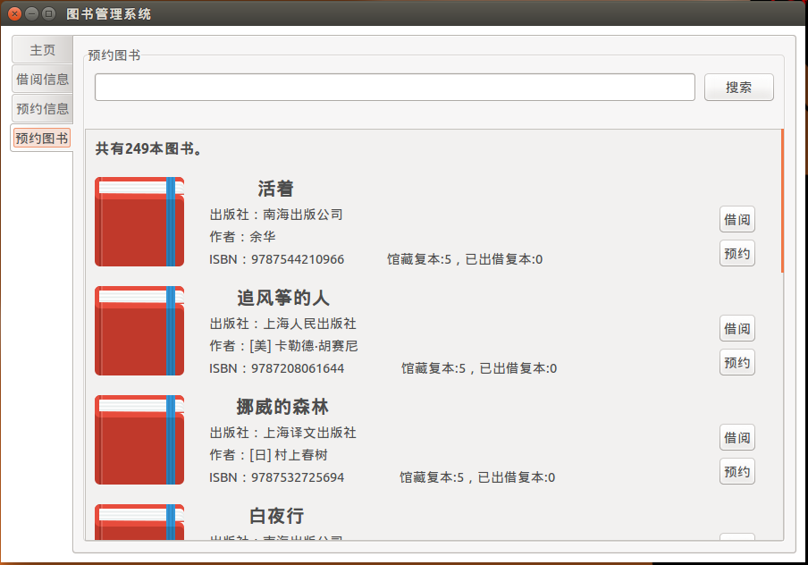
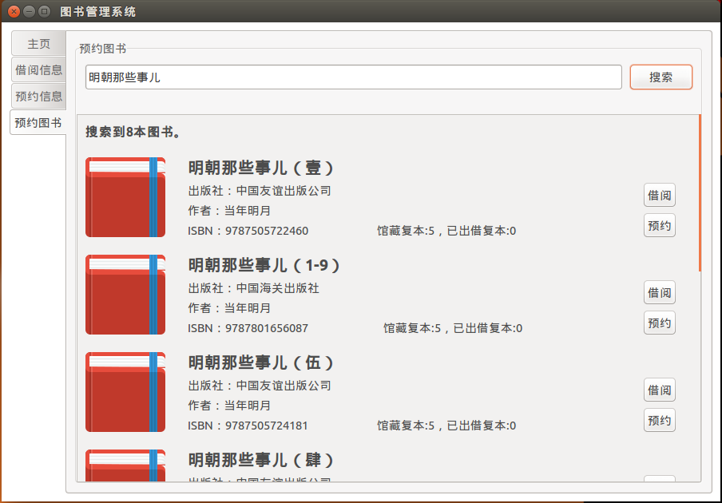
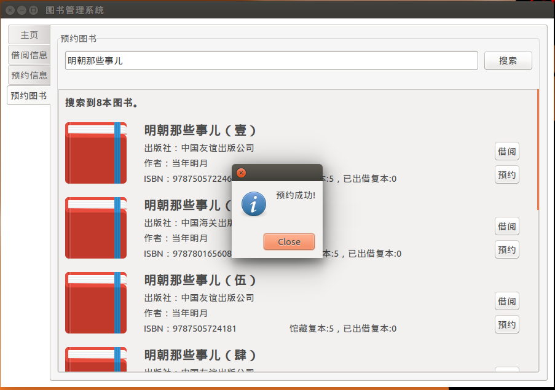
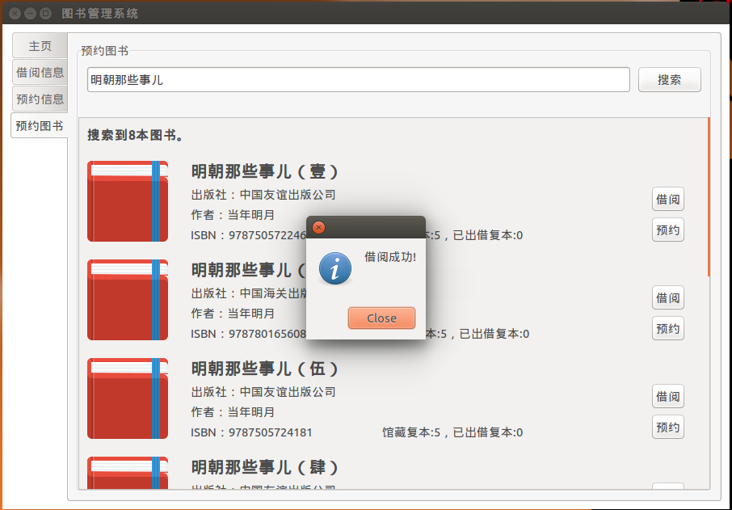
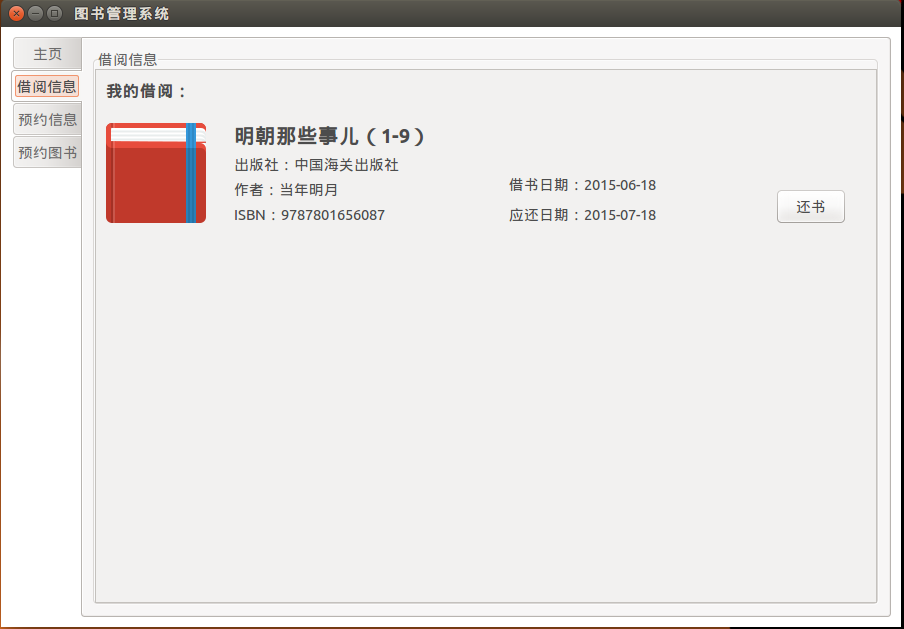
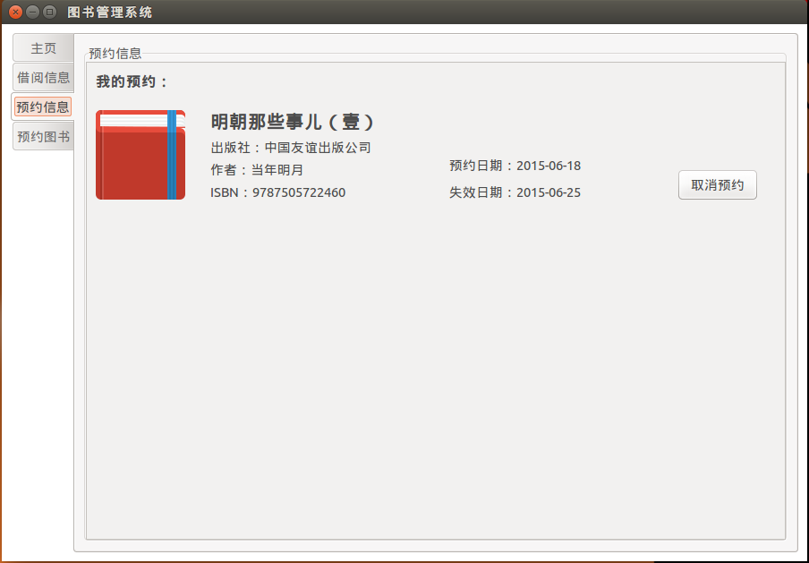

# 图书管理系统

## 依赖

本程序使用 Python2.7 编写，使用 PostgreSQL 作为数据库，使用 PyGTK 编写 GUI。所以请先确保已经正确安装如下程序：

- Python 2.7.x
- PostgreSQL 9.x
- PyGTK 2.x

在 shell 命令行如下所示，则表示 PostgreSQL 安装成功：
```shell
egrcc@egrcc-ubuntu:~$ sudo su - postgres
[sudo] password for egrcc: 
postgres@egrcc-ubuntu:~$ psql
psql (9.3.6)
Type "help" for help.

postgres=# 
```
如下所示则表示 PyGTK 安装成功：
```shell
egrcc@egrcc-ubuntu:~$ python
Python 2.7.6 (default, Mar 22 2014, 22:59:56) 
[GCC 4.8.2] on linux2
Type "help", "copyright", "credits" or "license" for more information.
>>> import gtk
>>> 
```

## 使用方法

#### 构建测试数据

首先，创建数据库用户 dbuser，并指定其为超级用户。在 shell 命令行下运行：
```shell
egrcc@egrcc-ubuntu:~$ sudo -u postgres createuser --superuser dbuser
```
然后，登录数据库控制台，**并设置 dbuser 用户的密码为：dbuser**，完成后退出控制台。
```shell
egrcc@egrcc-ubuntu:~$ sudo -u postgres psql
[sudo] password for egrcc: 
psql (9.3.6)
Type "help" for help.

postgres=# \password dbuser
Enter new password: 
Enter it again: 
postgres=# \q
```
接着，在 shell 命令行下，创建数据库 librarydb，并指定所有者为dbuser。
```shell
egrcc@egrcc-ubuntu:~$ sudo -u postgres createdb -O dbuser librarydb
```
添加新用户和新数据库以后，以新用户的名义登录数据库:
```shell
egrcc@egrcc-ubuntu:~$ psql -U dbuser -d librarydb -h 127.0.0.1 -p 5432
Password for user dbuser: 
psql (9.3.6)
SSL connection (cipher: DHE-RSA-AES256-SHA, bits: 256)
Type "help" for help.

librarydb=# 
```
接着运行 data.sql 文件里的 sql 语句创建四张表（请确保你在程序主目录下运行此命令）：
```shell
librarydb=# \i data.sql
```
data.sql 文件内容如下：
```sql
CREATE TABLE book(
	book_id serial primary key,
	book_name text,
	press text,
	author text,
	ISBN varchar(15),
	amount int,
	order_amount int,
	borrow_amount int
);

CREATE TABLE reader(
	reader_id serial primary key,
	name text,
	password text
);

CREATE TABLE order_book(
	book_id int,
	reader_id int,
	order_time date,
	expire_time date,
	primary key(book_id, reader_id),
	foreign key(book_id)references book(book_id),
	foreign key(reader_id)references reader(reader_id)
);

CREATE TABLE borrow_book(
	book_id int,
	reader_id int,
	borrow_time date,
	expire_time date,
	primary key(book_id, reader_id),
	foreign key(book_id)references book(book_id),
	foreign key(reader_id)references reader(reader_id)
);	
```

接着需要一些图书数据来模拟图书馆的图书资源。我选择以豆瓣top250作为示例图书。故需要从豆瓣上抓取图书数据。

Python 访问 PostgreSQL 需要 psycopg2，抓取数据需要 requests，BeautifulSoup，请确保这三个库均已正确安装，并且上面的数据库均已配置好。

在程序主目录下运行：
```shell
python data_manager.py
```
接下来需要创建一些用户用作测试，你可以随机创建。比如我创建了六个用户：
```shell
librarydb=# select * from reader;
 reader_id |  name   | password 
-----------+---------+----------
         1 | jack    | jack
         2 | gates   | gates
         3 | jobs    | jobs
         4 | gauss   | gauss
         5 | euler   | euler
         6 | riemann | riemann
(6 rows)

librarydb=# 
```

#### 运行程序

请确保上述步骤均已正确完成。

在程序主目录下运行：
```shell
python app.py
```
即可启动程序。

启动界面如下：


输入账号密码登录后，主界面如下：


当此账号没有借阅图书和预约图书时，显示如下界面：


可以到预约图书栏预约图书：




在搜索框中输入关键词搜索：



点击预约按钮进行预约：



点击借阅按钮进行借阅，当然实际借阅不可能这么简单，此处只是为了演示方便：



退出程序，重新登录即可看到目前的借阅信息和预约信息：





并且可以取消预约和还书，当然实际还书不可能这么简单，此处只是为了演示方便。

## License

    Copyright 2015 egrcc(Lujun Zhao)

	Licensed under the Apache License, Version 2.0 (the "License");
	you may not use this file except in compliance with the License.
	You may obtain a copy of the License at

     http://www.apache.org/licenses/LICENSE-2.0

	Unless required by applicable law or agreed to in writing, software
	distributed under the License is distributed on an "AS IS" BASIS,
	WITHOUT WARRANTIES OR CONDITIONS OF ANY KIND, either express or implied.
	See the License for the specific language governing permissions and
	limitations under the License.
